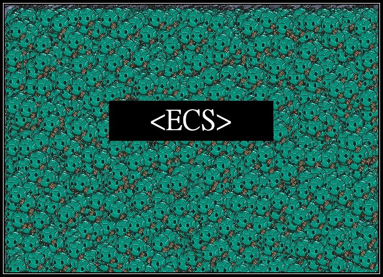
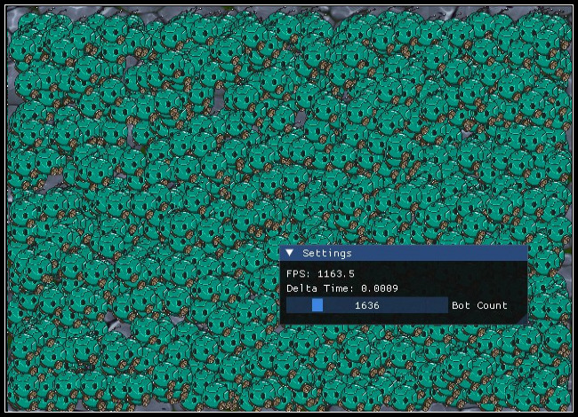

# Entity Component System

  

Simple ECS made from scratch for learning purposes, Comes with SDL3 Demo for wandering entities in a sandbox.

Densely packed Cache Friendly layout for components and data.

No RTTI overhead for type IDs.

## Features
- Entity Scene View
- Iterator Support **(Replaced with more versatile lambda based Each view)**
- Component Pool Storage Policy **(Deprecated)**
- Sparse Set Storage Policy
- Utility Functions For Creating ID on fly
- Version/Generation Support
- Compile time thread-safe Component Type IDs
- Demo World

## Component Storage
There are two main ways components are densely packed in this project, Pool and Sparse set, Pool performs better for this example but I still replaced it with sparse set due to it being more dynamic. If you have 10,000 Entity count that you are sure will be active for most of time then Pool is better however if you can suddenly go from 10,000 active Entities to only 10 then Sparse set will scale with entity count and will not waste cycles over dead entities.

You can still find code for Pool based ECS in my CPP-Tidbits Repository: [CPP-Tidbits/ECS](https://github.com/RoastedKaju/CPlusPlus-Tidbits/blob/main/src/ecs.h)

  

## Built With
- **Language**: C++ 20
- **Build System**: [CMake](https://cmake.org/)
- **Third Party**: SDL3, SDL3 Image, ImGUI 
- **Platform**: Windows
